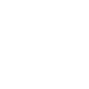

# portfolio-
	
## This is my Personal Portfolio website made using  HTML ,CSS and Bootstrap.Give it a look 👇
[](https://shiwi123.github.io/portfolio-/)
 <br>

 ## Description 
<p>A portfolio website is a best way to showcase your work and let others know about yourself. It’s like an evergreen platform for your projects, case studies, and information about you. Moreover, it’s one of the best ways to express your personality, experience, and capabilities.</p>
<p>As a Frontend Developer and Graphic Designer,Its utmost important to organise and showcase your work on a daily basis in a presentable manner.This project challenges both your designing and developer skills,letting me more closer, to work on this particular project.I have showcased my designing and frontend projects(mainly based on javascript) under work section of my portfolio.

<br>
<h3> Essential Elements of my portfolio</h3>
 
 - Name 
 - Logo
 - About section 
 - My picture
 - Skills 
 - Projects 
 - Contact information 

 <h3> Features</h3>

⚡️ Modern UI Design + Reveal Animations\
⚡️ Three Page Layout\
⚡️ Styled with Bootstrap v4.3\
⚡️ Responsive Home page\
⚡️ Gradient effect in text\
⚡️ Hover effect in icons 

## Glimpses of my portfolio-
<h2 align="center" style="background-color:black;">
	
</h2>
<h2 align="center"  style="background-color:black;">
	
</h2>

## How To Use 🔧

From your command line, first clone portfolio:

```bash
# Clone this repository
$ git clone https://github.com/shiwi123/portfolio-.git

# Go into the repository
$ cd portfolio

# Remove current origin repository
$ git remote remove origin
```

### How to run the portfolio locally?
1. Right click (Windows) or double click (Mac) `index.html` and select "Open with"
2. Pick your browser of choice

## Website structure 

### Hero section 
- On `.name` , Put your custom name 
- On `.logo` , Put your custom logo image
- On `.desc1` `.desc2` , Put your custom description 
```
 <div class="container" >
        <ul class="navbar-nav navbar-expand-sm nav-justified head">
            <li class="nav-item py-2">
              <a class="nav-link name " href="#">your name</a>
            </li>
            <li class="nav-item">
              <a class="nav-brand logo" href="#"></a>
            </li>
            
            <li class="nav-item py-2">
              <a class="nav-link contact" href="#contact">Let's Connect</a>
            </li>
        </ul>
        <p class="desc1">xyz</p>
        <p class="desc2">xyz</p>
    </div>
   ```
### About Section
- On `` tag, fill the `src` property with your profile picture, your picture must be located inside `images\` folder.
- On `.intro2` put your custom name 
- On `.intro3` write about yourself

```
<div class="container-sm about">
    
  <div class="row">
      <div class="col-md px-auto container-sm self" >
          <h1 class="intro1">Hi!   I'm</h1>
          <h1 class="intro2">Your name:)</h1>
          <p class="intro3">xyz</p>
          
      </div>
      <div class="col-md pic"></div>
     
  </div>
</div>
```
### Skill section 
- On `` tag, fill the `src` property with your skill icon image, your picture must be located inside `images\` folder.
- on `<p>` tag, fill the skill name
```
<div class="container skills" >
  <h1 class="heading">My skills<h1>
    <p id="subheading">Still in progress</p>
    <br>
<div class="row">
  <div class="col-sm box bg-gradient p-5 ">
  
  <p>HTML</p>
  </div>
  <div class="col-sm box bg-gradient p-5 ">
  
  <p>CSS</p>
  </div>
  <div class="col-sm box bg-gradient p-5 ">
  
  <P>JavaScript</P>
  </div>
</div>
<div class="row">
  <div class="col-sm box bg-gradient p-5">
  
  <p>Adobe Illustrator</p>
  </div>
  <div class="col-sm box bg-gradient p-5 ">
  
  <p>Adobe XD</p>
  </div>
  <div class="col-sm box bg-gradient p-5 ">
  
  <P>Figma</P>
  </div>
</div>
</div>
```
### Contact Section 

- On `<a>` tag, put your social links on `href` property.

```
<div class="container-sm contacts" id="contact" style="background-color: #faf7eb;">
    
  <div class="row">
      <div class="col-md container contactrow" style="padding-left:0px;padding-right: 0px;">
         <h1 id="contacthead" >Let's be internet <br> friends</h1>
           <div class="socialicons">
             <a class="icons py-3" target="_blank" href="https://www.facebook.com/shiwani.jha.9404/" title="facebook">
	     <i class="fab fa-facebook-f"></i></a>
             <a  class="icons"  target="_blank" href="https://www.instagram.com/_s.h.i.w.a.n.i._/" title="instagram">
	     <i class="fab fa-instagram"></i></a>
           </div>
           <div class="socialicons">
            <a class="icons"  target="_blank"  href="https://github.com/shiwi123" title="github"><i class="fab fa-github"></i></a>
            <a class="icons"  target="_blank" href="https://www.linkedin.com/in/shiwani-kumari-69298b207/" title="linkedin">
	    <i class="fab fa-LinkedIn-in"></i></a>
          </div>
          <div class="socialicons">
            <a class="icons"  target="_blank" href="https://www.behance.net/shiwanikumari" title="Behance">
	    <i class="fab fa-behance"></i></a>
            <a class="icons"  target="_blank" href="https://dribbble.com/shiwi123" title="Dribble">
	    <i class="fab fa-dribbble"></i></a>
          </div>
          <div class="socialicons">
            <a class="icons"  target="_blank"  href="https://twitter.com/shiwani46334156" title="twitter">
	    <i class="fab fa-twitter"></i></a>
            <a class="icons"  target="_blank"  href="mailto:shiwi7079@gmail.com" title="email">
	    <i class="fas fa-envelope"></i></a>
          </div>
      </div>
      <div class="col-md msg">
         <h1 class="px-3">Want to work <br> together ?</h1>
         <p class="px-3">I believe your website should celebrate 
	 what makes your business unique, connect you with new 
	 people who will love what you do, and faster stronger
	 relationships with your existing customers. I’d love 
	 to hear about your project. Drop me a line at</p>
         <a class="px-3" href="mailto:shiwi7079@gmail.com">shiwi7079@gmail.com</a>
      </div>
     
  </div>
</div>
```


## Bugs and Issues
Have a bug or an issue with this template? [Open a new issue](https://github.com/shiwi123/portfolio-/issues)

## Authors

- **Shiwani kumari** - [Github profile](https://github.com/shiwi)

## License 📄

This project is licensed under the MIT License - see the [LICENSE](license.txt) file for details

